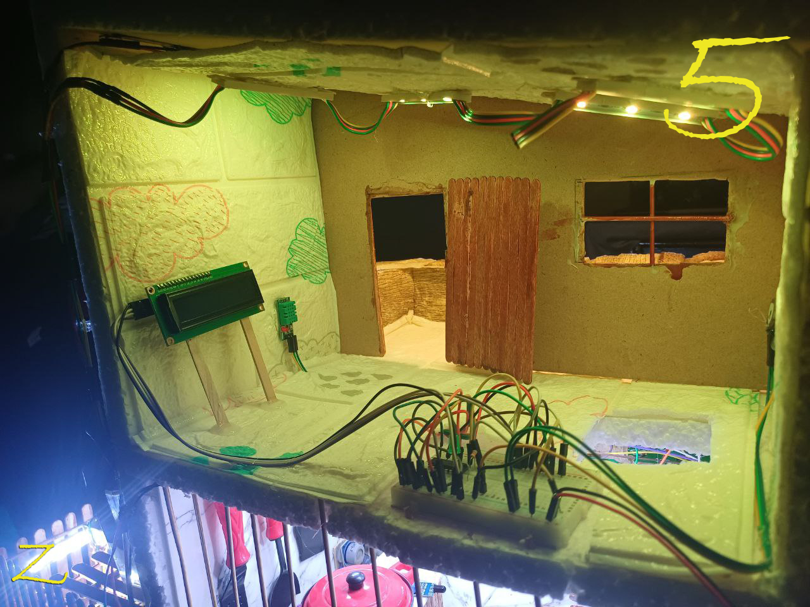
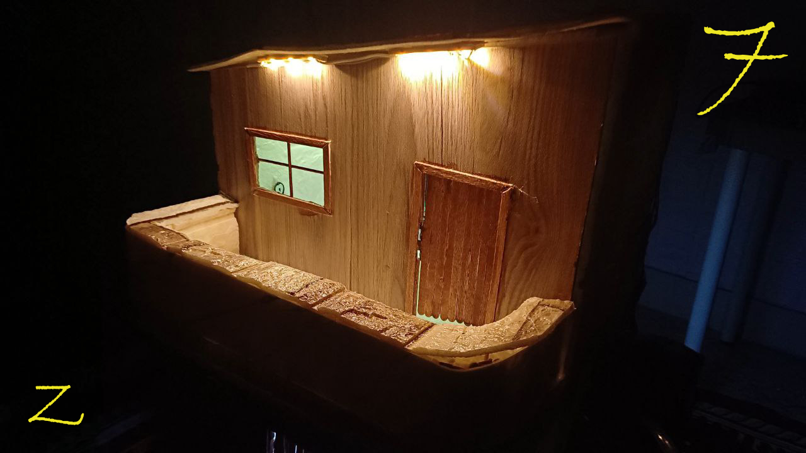
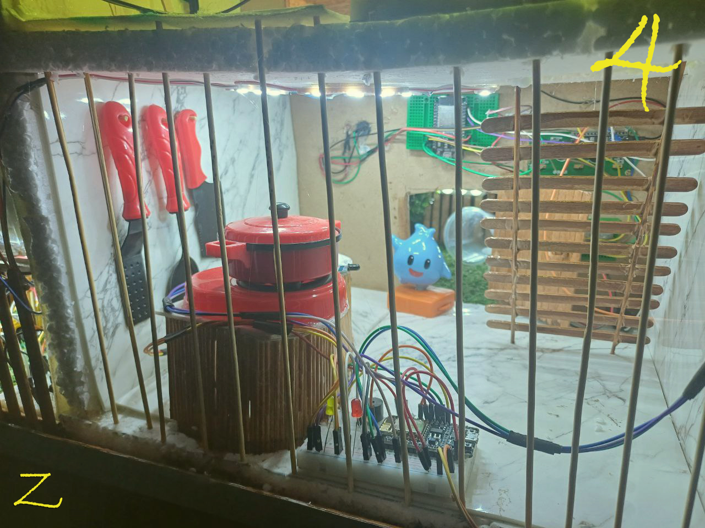
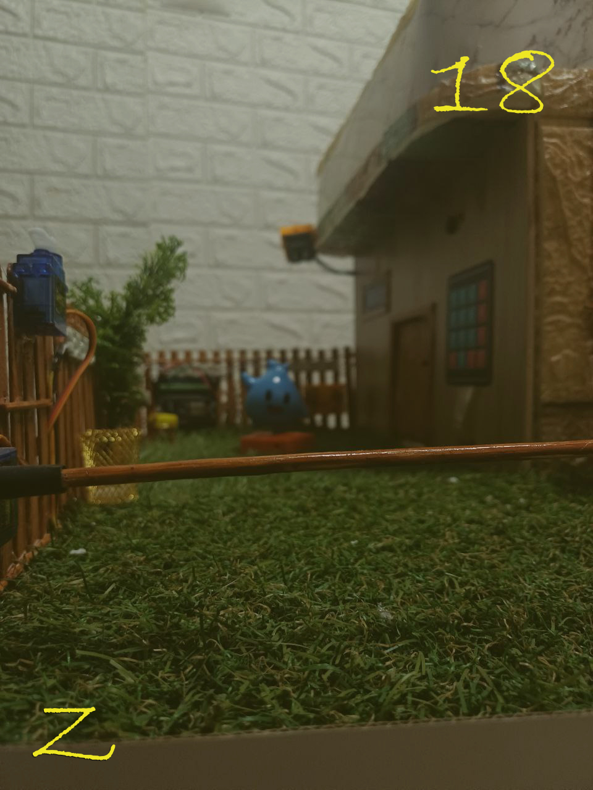
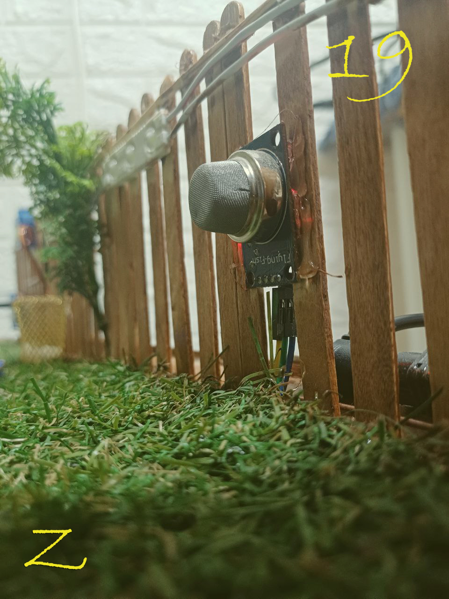
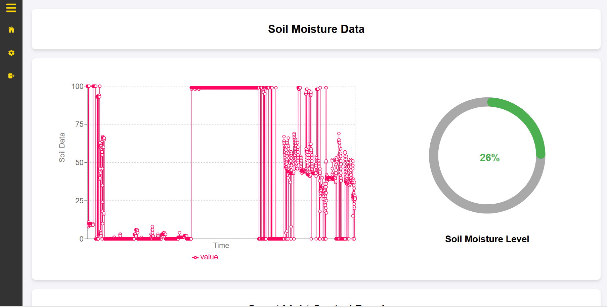
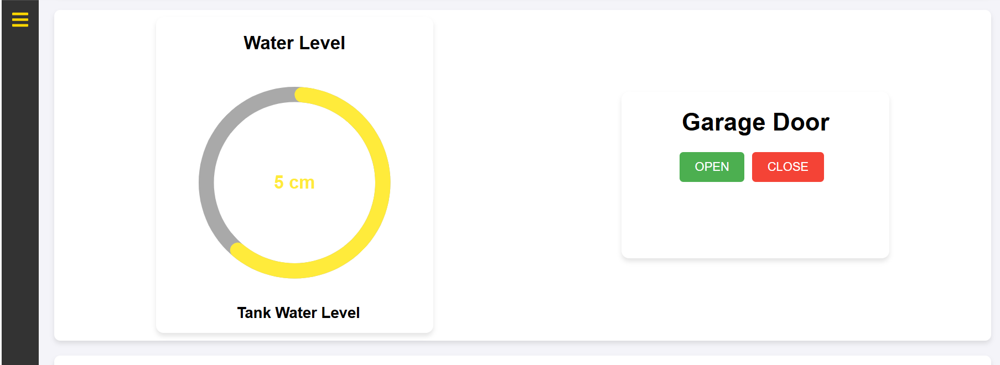
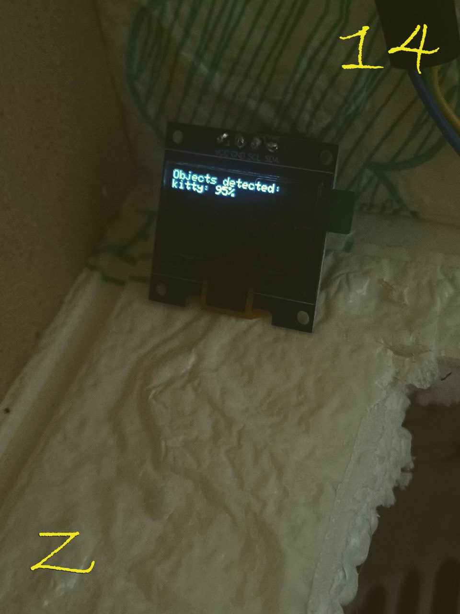

# 🏠 Smart Home IoT Project

## 🌐 Overview

**Smart Home** is a full-stack **Internet of Things (IoT)** project that showcases the seamless integration of **hardware**, **networking**, and **software** layers to create a fully connected and automated home environment.

This project focuses on understanding the **entire data journey** — from **sensor data acquisition**, **microcontroller processing**, and **network communication**, to **cloud storage**, **data visualization**, and **user interaction**.

### 🔑 Key IoT Concepts Demonstrated
- **Real-time monitoring** and **control** of home devices  
- **Data-driven automation** using sensors and actuators  
- **Secure communication** between edge devices and the cloud  
- **Scalable backend infrastructure** and **interactive user interface**  

Smart Home provides practical insights into how modern IoT systems operate **End-to-End (E2E)**, combining **embedded systems**, **networking**, and **full-stack web development**.

---

<table>
  <tr>
    <td></td>
    <td></td>
    <td></td>
  </tr>
  <tr>
    
    <td></td>
  </tr>
  <tr>
    <td></td>
    <td></td>
    <td></td>
  </tr>
  <tr>
    <td></td>
    <td></td>
    <td></td>
  </tr>
</table>

  

🎥 [**Watch the Project Video Here**](https://www.linkedin.com/posts/ziad-essam-ze3_internet-smarthome-iotarchitectures-activity-7346913489799569409-MUAe?utm_source=share&utm_medium=member_desktop&rcm=ACoAAEr_ZYkBYQUXFgZu-JybrGqGfnDZx2rhZRM)

---

## ⚙️ Project Structure

The project integrates **Hardware**, **Network**, **Backend**, and **Frontend** layers to create a fully connected smart home.

### 🧩 1) Hardware Side:
- Sensors: Gas, rain, temperature, humidity, weight, heart rate, water level, soil moisture, ultrasonic (tank level), and IR sensors.
- Actuators: Servos for doors, LCD, and OLED displays.
- Camera integrated with an **Edge Impulse** trained model for object detection (e.g., Spider-Man, Kitty, etc.).
- Microcontrollers: **ESP32**, **ESP8266**, **ESP-CAM**.

### 🌐 2) Network Architecture:
- Implemented a **Star Topology** for internal communication.
- Used **Wi-Fi** for transmitting data to the cloud.

### 💻 3) Backend Creation:
- Built with **Node.js** and **Express.js**.
- Developed a complete **RESTful API**.
- Implemented **Authentication** and **Encryption**.
- Database: **MongoDB Atlas** (Cloud-hosted and scalable).

### 🎨 4) User Interface:
- **React.js** with **Vite** for the frontend.
- **Recharts** for dynamic data visualization.
- **Material-UI** for a clean, modern UI.

---

## 🧠 Tech Stack

| Category | Technologies |
|-----------|---------------|
| **Frontend** |   |
| **Backend** |   |
| **Database** |  |
| **AI & Edge** |  |
| **Hardware** |  |
| **UI** |   |

---

## 🔗 Connect with Me

📎 **LinkedIn:** [Ziad Essam](https://www.linkedin.com/in/ziad-essam-ze3)

---

⭐ *If you liked this project, don’t forget to star the repo and share your thoughts!*
